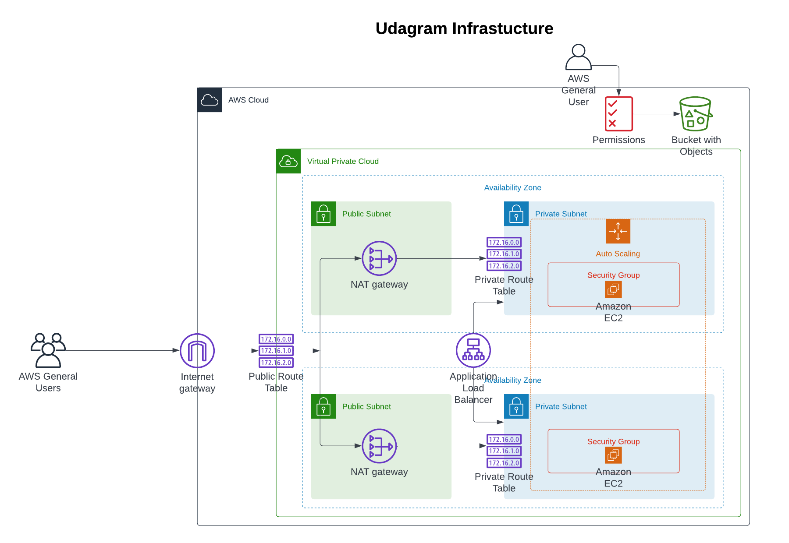

# Deploy a high-availability web app using CloudFormation
### Project 2 of Udacity CDND 


> This project contains the script for deploying a high-availability web app using Cloudformation. Access it through this link [http://udagr-webap-4r4ew3kosa8j-1019103400.us-east-1.elb.amazonaws.com/](http://udagr-webap-4r4ew3kosa8j-1019103400.us-east-1.elb.amazonaws.com/)

### How to run the project
#### 1. You would require an AWS account to deploy the Infrastructure.
Make sure AWS cli is configured.

#### 2. RUn the ff script
```bash
# To create the stack
./create.sh stackName udagram-cf-config.yml udagram-cf-params.json

#To make updates to the stack
# To create the stack
./update.sh stackName udagram-cf-config.yml udagram-cf-params.json
```